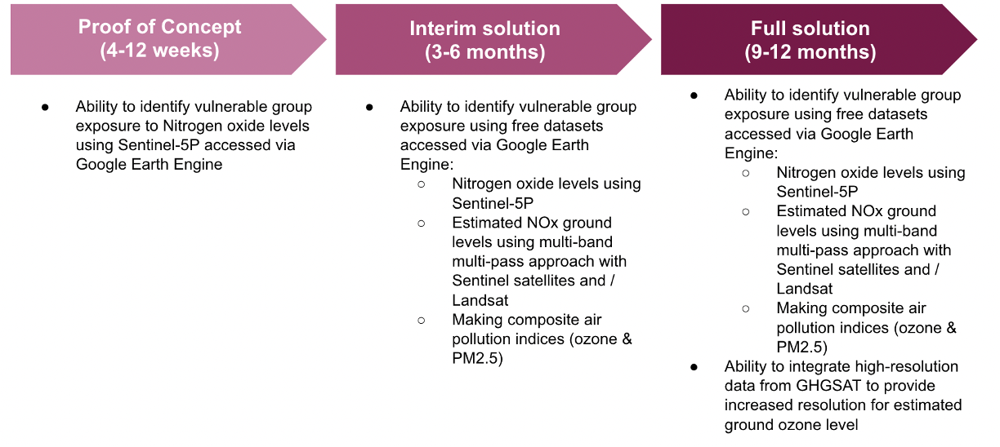

London is the capital city of the United Kingdom and has a population of 9.84 million. Air pollution is a public health crisis in London, causing up to 9400 extra deaths each year (source: London Air Quality Network) 

```{r echo=FALSE, out.width='100%', fig.align='left'}
knitr::include_graphics("https://www.london.gov.uk/sites/default/files/styles/media_component_16_9_lg/public/london-plan-image-2x1.png?h=8deaf57e&itok=bALShO-G")
```

---

## London's Air Quality Problem

```{r echo=FALSE, results='asis'}
cat('
<div style="display: flex; justify-content: space-between;">
  <div style="text-align: center; width: 48%;">
    
    <p><span style="color: black;">Source:</span> <a href="https://www.bbc.co.uk/news/articles/c4nw2r72l5ro" target="_blank">BBC News</a></p>
  </div>
  <div style="text-align: center; width: 48%;">
    
    <p><span style="color: black;">Source:</span> <a href="https://www.bbc.co.uk/news/uk-england-london-58230278" target="_blank">BBC News</a></p>
  </div>
</div>
')
```


---

## Improvements since ULEZ

https://www.theguardian.com/environment/2025/mar/07/london-air-pollution-down-since-ulez-expansion-study

https://www.thetimes.com/uk/environment/article/expanded-ulez-cuts-emissions-nitrogen-dioxide-d5tz22fdr

Are these enough?  Percentage decrease mentioned but not actual levels. What are the actual levels? Are they still at harmful level?

---

## 11th March 2025
https://metro.co.uk/2025/03/11/air-quality-bad-london-right-now-22708829/

---

# Policy

## Sustainable Development Goals:

- *SDG 11: Sustainable Cities and Communities*
 - Target 11.6: By 2030, reduce the adverse per capita environmental impact of cities, including by paying special attention to air quality and municipal and other waste management.
 - Indicator 11.6.2: Annual mean levels of fine particulate matter (e.g., PM₂.₅ and PM₁₀) in cities (population-weighted).
 
- *SDG 3: Good Health and Well-being*
 - Target 3.9: By 2030, substantially reduce the number of deaths and illnesses from hazardous chemicals and air, water, and soil pollution and contamination.
 - Indicator 3.9.1: Mortality rate attributed to household and ambient air pollution.

https://www.who.int/news-room/feature-stories/detail/what-are-the-who-air-quality-guidelines

---

# Policy

## London Plan 2021

- *GG3: Creating a healthy city*
 - GG3F: seek to improve London’s air quality, reduce public exposure to poor air quality and minimise inequalities in levels of exposure to air pollution
- *SI1: Improving Air Quality*
 - Identify and deliver further improvements to air quality and should not reduce air quality benefits that result from the Mayor’s or boroughs’ activities to improve air quality.
 - Tackle poor air quality and protect health.
 - Development should not: 
  - lead to further deterioration of existing poor air quality
  - create any new areas that exceed air quality limits, or delay compliance
  - create unacceptable risk of exposure to poor air quality

---


# Data required

- Must include at least one EO dataset

Sentinel 5-P 

Pollution data:

https://data.london.gov.uk/dataset/london-atmospheric-emissions-inventory--laei--2019

https://www.londonair.org.uk/london/asp/dataspecies.asp?species=NO2m

https://data.london.gov.uk/dataset/lsoa-atlas

https://www.ecmwf.int/en/about/what-we-do/environmental-services/copernicus-atmosphere-monitoring-service

https://ads.atmosphere.copernicus.eu/datasets/cams-europe-air-quality-reanalyses?tab=download

Air Quality Sensors:
https://thepihut.com/collections/environment-air-quality-sensors?srsltid=AfmBOooawErsmJrecmHc8nh24Tm0bjV-LphdNFqhXgXjTheSusDxX183

---

# Process

In August 2023 the mayor of London expanded the ultra low emission zone across all london boroughs to help tackle air pollution 

In 2019 it was piloted in central london 

In 2021 it was expanded up to the north and south circular roads 
And now all of london.

Pollutants: NO2 and SO2 and PM2.5 (collected by the sensor) (These pollutants were chosen by the GLA to analyse). 

---
Creating a GEE dashboard with a layer showing the multi date PCA between 2019, 2021 and 2023, NDVI and temperature. Also potentially finding public health data that is spatial and undertaking regression regression or machine learning to identify the worse off areas. 

A PCA layer for sentinel 5P - 
And then including a layer that shows more localised air quality levels taken from the air quality sensors. 

Also including a layer of traffic counts from the tfl and  
Shapefiles of the 2019-2021 and 2023 zones (Can be found from TFL but we could always make our own).

Through this we can visually explore the impacts of ULEZ on air quality in london. By combining remote sensing data, traffic data, and local sensor data, the dashboard provides a holistic view of how the ULEZ is influencing air quality and subsequently improving public health/ the environment. This could inform future policy decisions, such as further expansions of ULEZ, modifications to traffic management, or increased investment in green spaces.

---

# Embedding within BAU


---

# Benefits

---

# Limitations


---

# We propose three phases of iterative deployment focusing on delivering value as soon as possible

```{r}
<div style="display: flex; justify-content: space-between;">
    
    <p><span style="color: black;">Source:</span></p>
</div>
```


---

# Project Planning - Work Packages

- Details of each work package
- Possibly overlaps the Process slide so need to see how this works in practice


---

# Project Planning - Costs

---

#Summary
