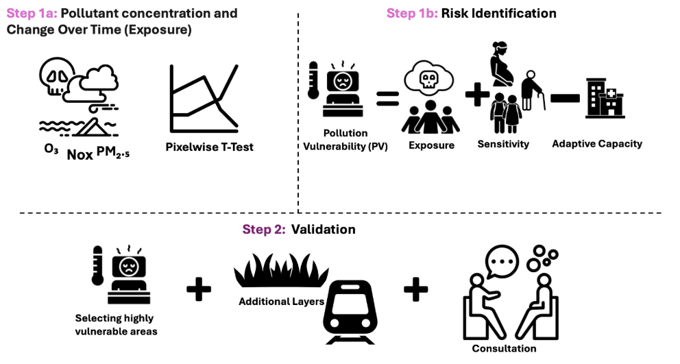
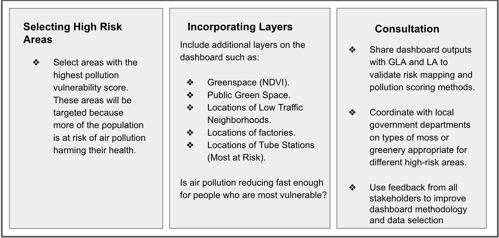
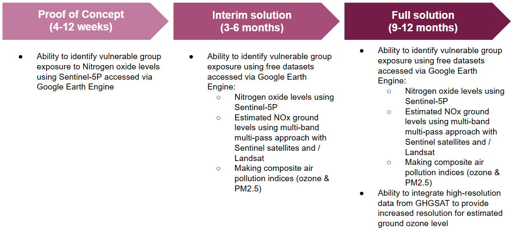

class: inverse, center, middle
background-color: #800020
color: white

# What is London's Air Quality Problem?

---

London is the capital city of the United Kingdom and has a population of 9.84 million. 

Air pollution is a public health crisis in London, causing up to 9,400 extra deaths each year (Source: [London Air Quality Network](https://www.londonair.org.uk/LondonAir/General/research.aspx)) 


```{r echo=FALSE, results='asis'}
cat('
<div style="background-color: #f0f0f0; padding: 15px; border-radius: 10px;">
<div style="display: flex; justify-content: space-between;">
  <div style="text-align: center; width: 33%;">
    
    <p style="font-size: small;"><span style="color: black;">Source:</span> <a href="https://www.bbc.co.uk/news/articles/c4nw2r72l5ro" target="_blank">BBC News</a></p>
  </div>
  <div style="text-align: center; width: 33%;">
    
    <p style="font-size: small;"><span style="color: black;">Source:</span> <a href="https://www.bbc.co.uk/news/uk-england-london-58230278" target="_blank">BBC News</a></p>
  </div>
  <div style="text-align: center; width: 33%;">
    
    <p style="font-size: small;"><span style="color: black;">Source:</span> <a href="https://www.bbc.co.uk/news/uk-england-london-58230278" target="_blank">BBC News</a></p>
  </div>
</div>
')
```


```{r echo=FALSE, results='asis'}
cat('
<div style="display: flex; justify-content: space-between;">
  <div style="text-align: center; width: 33%;">
    
    <p style="font-size: small;"><span style="color: black;">Source:</span> <a href="https://www.standard.co.uk/news/london/high-air-pollution-warning-issued-for-london-b1217767.html" target="_blank">The Standard</a></p>
    </div>
    <div style="text-align: center; width: 33%;">
    
    <p style="font-size: small;"><span style="color: black;">Source:</span> <a href="https://news.sky.com/story/anti-poison-ulez-scheme-has-lowered-air-pollution-most-in-london-boroughs-that-opposed-it-13323222" target="_blank">Sky News</a></p>
    </div>
    <div style="text-align: center; width: 33%;">
    
    <p style="font-size: small;"><span style="color: black;">Source:</span> <a href="https://www.thetimes.com/uk/environment/article/expanded-ulez-cuts-emissions-nitrogen-dioxide-d5tz22fdr" target="_blank">The Times</a></p>
    </div>
</div>
')
```

---

### We will help you meet these related policies

```{r xaringan-panelset, echo=FALSE}
xaringanExtra::use_panelset()
```

```{r echo=FALSE}
xaringanExtra::style_panelset_tabs(
  active_foreground = "#d22"
)
```

.panelset.sideways[
.panel[.panel-name[Sustainable Development Goals]
- **SDG 11: Sustainable Cities and Communities**
  - *Target 11.6*: By 2030, reduce the adverse per capita environmental impact of cities, including by paying special attention to air quality and municipal and other waste management.
  - *Indicator 11.6.2*: Annual mean levels of fine particulate matter (e.g., PM₂.₅ and PM₁₀) in cities (population-weighted).
 
- **SDG 3: Good Health and Well-being**
  - *Target 3.9*: By 2030, substantially reduce the number of deaths and illnesses from hazardous chemicals and air, water, and soil pollution and contamination.
  - *Indicator 3.9.1*: Mortality rate attributed to household and ambient air pollution.
]

.panel[.panel-name[London Plan 2021]
- **GG3: Creating a healthy city**
<br><br>
 - *GG3F*: seek to improve London’s air quality, reduce public exposure to poor air quality and minimise inequalities in levels of exposure to air pollution
<br><br>
- **SI1: Improving Air Quality**
<br><br>
  - Identify and deliver further improvements to air quality 
  - Tackle poor air quality and protect health.
    - Development should not:
      - lead to further deterioration of existing poor air quality
      - create any new areas that exceed air quality limits, or delay compliance
      - create unacceptable risk of exposure to poor air quality
]

.panel[.panel-name[World Health Organisation]
```{r echo=FALSE, out.width='100%'}

```
]
]

---

### What is happening right now (what is the baseline)

- Air quality in London is improving but there is still a lot of work to do
- London is far behind meeting WHO guidelines
- Continuing to expose the population to significant health risks

.panelset.sideways[
.panel[.panel-name[Borough sites exceeding legal levels]
```{r echo=FALSE, out.width='100%'}

```
]

.panel[.panel-name[Avergage Nitrogen Dioxide levels]
```{r echo=FALSE, out.width='100%'}

```
]]

.footnote[
<span style="font-size: 10px;">Source: [Greater London Authority](https://data.london.gov.uk/dataset/air-quality-monitoring-diffusion-tube-results)</span>
]

---

.pull-left[

### The consequences of doing nothing...  

<div style="background-color:#FFCDD2; padding:10px; border-radius:5px;">
<strong>Deaths:</strong><br style="line-height:1.5;">
- Global: 4.2 million (~7% of total deaths)<br style="line-height:1.5;">
- UK: 28,000 - 36,000<br style="line-height:1.5;">
- London: 9,400  
</div>
<br>
<div style="background-color:#C8E6C9; padding:10px; border-radius:5px;">
<strong>Disease by 2035:</strong><br style="line-height:1.5;">
- >1.3 million new cases caused by PM2.5<br style="line-height:1.5;">
- >1.1 million caused by NO2  
</div>
<br>
<div style="background-color:#BBDEFB; padding:10px; border-radius:5px;">
<strong>Financial Burden:</strong><br style="line-height:1.5;">
- Total estimated costs to NHS and socal care:<br style="line-height:1.5;">
- £1.6 to £5.56 billion
</div>

]

.pull-right[
### This will help everybody  

```{r echo=FALSE, out.width='100%'}

```

More needs to be done, would a targeted approach reap more benefits to those most vulnerable to air pollution?

This is where we can help....
]

.footnote[
<span style="font-size: 10px;">Sources: [World Health Organization](https://www.who.int/news-room/fact-sheets/detail/ambient-%28outdoor%29-air-quality-and-health), [London Air Quality Network](https://www.londonair.org.uk/LondonAir/General/research.aspx), [Public Health England](https://www.gov.uk/government/publications/health-matters-air-pollution/health-matters-air-pollution)</span>
]

---

class: inverse, center, middle
background-color: #556B2F
color: white

# Our Solution

---

### By integrating remote sensing data we can support you in linking, identifying and supporting vulnerable populations
<br><br><br>
.pull-left[
<div style="background-color:#B0BEC5; padding:15px; border:2px solid #8B0000; border-radius:5px; margin-bottom:10px;">
  <strong>The Challenge</strong>
</div>

<div style="background-color:#ECEFF1; padding:15px; border:2px solid #8B0000; border-radius:5px;">
  Lack of a targeted approach to tackle areas in London where people are most vulnerable to air pollution
</div>
]

.pull-right[
<div style="background-color:#B0BEC5; padding:15px; border:2px solid #006400; border-radius:5px; margin-bottom:10px;">
  <strong>We Propose</strong>
</div>

<div style="background-color:#ECEFF1; padding:15px; border:2px solid #006400; border-radius:5px;">
  The ability to monitor air pollution data in real time and to visualise pollution vulnerability in London. 
</div>
]

---

## Methodology

```{r echo=FALSE, out.width='100%'}

```

---

### Step 1: Pollutant monitoring and risk identification
<br>
```{r echo=FALSE, out.width='100%'}

```

---

### Step 2: Validation
<br>
```{r echo=FALSE, out.width='100%'}

```

---

### Sample Dashboard Preview
<br>
```{r echo=FALSE, out.width='100%'}

```

---

### A holistic approach to air quality monitoring 

**Strengths:**

*Equity-driven focus:* Helps direct resources to communities that suffer the most from poor air quality. Encourages targeted policy interventions that can reduce health disparities.

*Multi–layer approach:* Observing NOx, PM₂.₅, and O₃ together, alongside greenspace and traffic data, provides a more holistic understanding of air pollution impacts.

**Limitations:**

*Temporal Mismatch:* Satellite and ground sensor data may not align perfectly in time.

*Uncertainty in downscaling:* Estimating pollution levels at a higher resolution introduces potential error. 

---

class: inverse, center, middle
background-color: #004D40
color: white


# Implementation plan

---

### We propose three phases of iterative deployment focusing on delivering value as soon as possible 
<br>
```{r echo=FALSE, out.width='100%'}

```

---

### We will work in an agile way and align our team to deliver against our proposed milestones 
<br>
```{r echo=FALSE, out.width='100%'}

```

---

class: inverse, center, middle
background-color: #301934
color: white

# Appendix

---

### Earth Observation Data
<br>
```{r echo=FALSE, out.width='100%'}

```

---

### Other Data
<br>
```{r echo=FALSE, out.width='100%'}

```

---

### Methodology - Step 1 - Detailed
<br>
```{r echo=FALSE, out.width='100%'}

```

